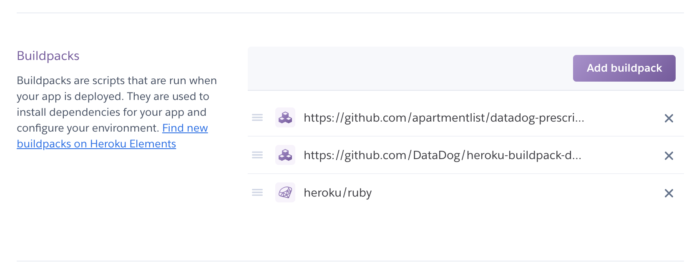

# datadog-prescript

This is a Heroku buildpack to add `datadog/prerunscript.sh` in your dyno, and it will add extra tags in the agent.

Note: Buildpack is order-sensitive. This buildpack **has to be** precedent to Datadog Buildpack. It means that `https://github.com/apartmentlist/datadog-prescript.git#_VERSION_` should be above `https://github.com/DataDog/heroku-buildpack-datadog.git` as it shows below.



If you prefer a command-line better (in the following example, `_VESRION_` is `0.2`):

```
% heroku buildpacks --app alp-***
=== alp-*** Buildpack URLs
1. https://github.com/apartmentlist/datadog-prescript.git#0.2
2. https://github.com/DataDog/heroku-buildpack-datadog.git
3. heroku/ruby
```
